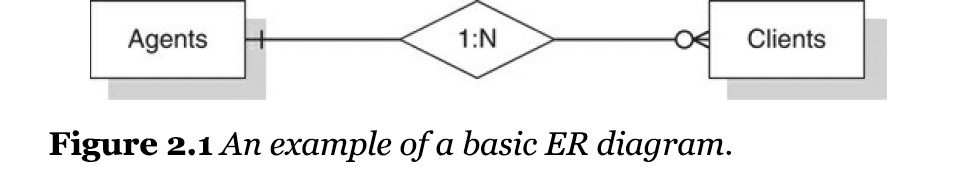

# Objectives
The part covers "Hernandez, Michael J. (2020). Database Design for Mere Mortals:4th Edition. Addison-Wesley" chapter 1 and chapter 2

# What is database
- two types of databases
	- operational database
		- used on online transaction processing (OLTP)
		- the data in operational database is dynamic
		- retail stores, manufacturing companies, is in a constant state of flux
	- analytical database
		- used in online analytical processing (OLAP)
			- track historical and time-dependent data
			- store static data, and the data is never modified
			- chemical labs, geological companies, and marketing analysis
			- use operational database as their main database
### Relational database
- Dr. Edgar F. Codd, was a IBM research scientist
	- A relational model of data for large shared databanks in June of 1970
- A relational database stores data in relations, and the user would perceive as tables.
	- each relation is composed of tuples, or records, and attributes, or fields
- 2 characteristics of a relational database that allow the data to exist independently
	- categorizes relationships as one-to-one, one-to-many, many-to-many
		- for instance, the CLIENTS and AGENTS tables share a one-to-many relationship and related via an AGENT ID field![Relation-in-database.png]
### retrieve data
- retrieve data in a relational database by using structured query language (SQL)
### advantages of a relational database
- built-in multilevel integrity: data integrity is built into database at the field level to ensure the accuracy of the data, at the table level to sure that records are not duplicated and to detect missing primary key values
- logical and physical data independence from database applications: neither changes a user makes to the logical design of the database nor changes a database software vendor 
- guaranteed data consistency and accuracy: data is consistent and accurate due to the various levels of integrity you can impost within the database
- easy data retrieval: a user can retrieve data either from a particular table or from any number of related tables within the tables.
### relational database management systems
- relational database management system (RDBMS) is a software application program you use to create, maintain, modify and manipulate a relational database.
- provide the tools you need to create a wide variety of end-user application that interact with the data stored in the database.

## Design Objectives
### why should you be concerned with database design
- the tools like RDBMS does not actually help you design a database -- they merely help you create the physical tables you will include in the table
- we would better to use these tools after creating the logical database structure
- RDBMS provide the design tools and the sample databases to help minimize the time it takes you to implement the database structure physically.
- **crucial to the consistency, integrity and accuracy** in the database
### The importance of theory
- What is *theory*: general propositions used as principles and not "conjectures or proposals" 
- a number of major disciples have some types of theoretical basis.
- The relational database is based on **set theory** and **first-order predicate logic**

### The advantage of learning a good design methodology
- by trial and error
- advantages
	- gives the skills to design a sound database structure 
		- avoid all this by employing a good design methodology
	- provide you with an organized set of techniques that will guide you step by step though the design process
	- helps you keep you missteps and design reiterations to a minimum
	- make the design easier and reduce the amount of time
	- use the RDBMS application system more fully and effectively
### objectives of good design
- support both required and ad hoc information retrieval 
- the tables are constructed properly and effectively. Each table in the database represents a single subject and is composed of relatively distinct fields. keep redundant data to a minimum
- Data integrity is imposed at the field, table and relationship levels
- The database supports the business rules relevant to the organization
	- provide valid and accurate information
- The database lends itself to the future growth

### Benefits of good design
- save time
- the data structure easy to modify and maintain
- The data is easy to modify
- information is easy retrieve
- end-user applications are easy to develop and build. We can spend more time on programming and addressing the data manipulation tasks at hand 

### Database design methods
#### Traditional Design methods
- traditional methods have three phases:  requirement analysis, data modeling, and normalization
	- requirement analysis
		- an examination of business being modeled, interviewed with users and management to access the current system and to analyze future needs, and an assessment of information requirement for the business as a whole
	- Data modeling
		- modeling and database structure using data-modeling method, such as entity-relationship (ER) diagramming, semantic-object modeling, object-role modeling, or UML modeling. Provide a visually representing various aspects of the data structure, such as tables. 
			- rectangles represent two tables called AGENTS and CLIENTS
			- the diamond represent a relationship between these two tables, and the "1:N" within the diamond indicates that it's a one-to many relationship
			- the vertical line next to the AGENTS table indicate that a client must be connect with only one gent, and the circle and "crow's foot" next to the CLIENTS table indicates that an agent does not have to be associated with a client, but can have many
		- Each tables is assigned a primary key, various levels of data integrity are identified and implemented. 
		- Relationships are established via *foreign* keys
		- After the initial relationships have been established according to data model, the database is ready to go through the normalization phase.
	- Normalization
		- the process of decomposing large tables into smaller ones in order to eliminate redundant data and duplicate data
		- table structures are tested against normal forms and the modified if any of the aforementioned problems are found.
		- a normal form is a specific set of rules that can be tested a table structure to ensure that it's sound and free of problems
